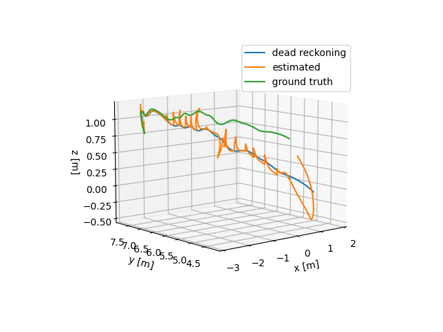
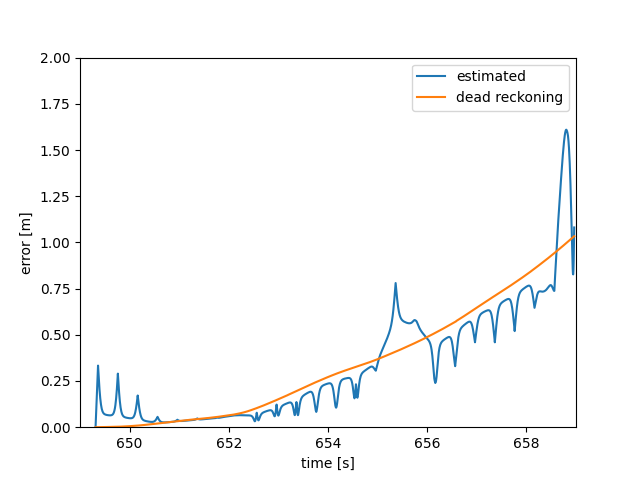

# Mini Visual-Inertial SLAM

This project provides a minimal SLAM architecture in order to study the underlying optimization procedures. In particular, we investigate both optimization-based and EM-based algorithms. For demonstration, we use [EuRoC dataset](https://projects.asl.ethz.ch/datasets/doku.php?id=kmavvisualinertialdatasets#the_euroc_mav_dataset).

## Build instruction

To build this project, just follow standard CMake procedure.
```
mkdir build
cd build
cmake .. [-D BUILD_TEST=OFF]
cmake --build .
```

## Usage

Please check the configuration file `config/test.yaml` for the workflow including both frontend and backend.

To run `frontend`, please provide the directory of images.
```
./apps/frontend [path_to_image_directory]
```

To run `backend`, one needs to sepcify three files: observation file, IMU file, and ground truth for initialization.
```
./apps/backend [path_to_observation_file] [path_to_imu_file] [path_to_ground_truth_file]
```

Currently, for developing, I write the paths in the code. Therefore, directly executing those files without argements is fine.

## Result




No covariance is specified now, and no preintegration is implemented yet.